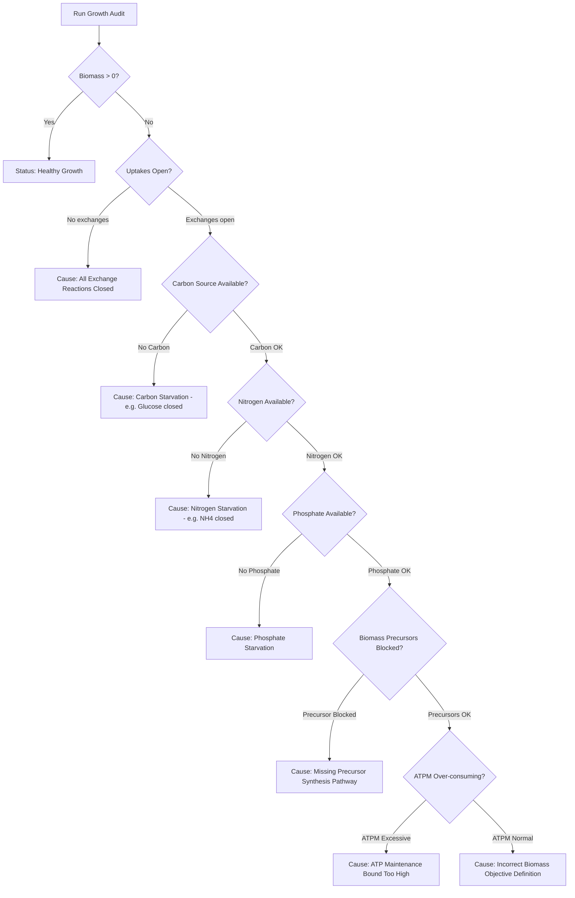

# 🧬 SynB Platform: Biology Handover & Scientific Reference Guide

Welcome to the **SynB Metabolic Engineering & Genome Reconstruction Platform**. This comprehensive guide is written specifically for biologists, metabolic engineers, biotechnologists, and computational biologists. 

It explains **what SynB does**, **what inputs are required**, **what calculations and biological concepts are used**, **what outputs you receive at every step**, and **how to interpret the results** to guide wet-lab experiments or computational research.

---

## 📑 Table of Contents
1. [Overview & Platform Purpose](#-1-overview--platform-purpose)
2. [Key Biological & Mathematical Concepts (Glossary)](#-2-key-biological--mathematical-concepts-glossary)
3. [Input Requirements & Supported File Formats](#-3-input-requirements--supported-file-formats)
4. [Detailed Tab-by-Tab Breakdown](#-4-detailed-tab-by-tab-breakdown)
   - [0. Model Ingestion & Genome Reconstruction](#0-model-ingestion--genome-reconstruction)
   - [Tab 1: 📊 Model Summary (Network Inspection)](#tab-1--model-summary-network-inspection)
   - [Tab 2: 📈 FBA Diagnostics (Simulation & Growth Rate)](#tab-2--fba-diagnostics-simulation--growth-rate)
   - [Tab 3: 🔍 Validation (Model Quality Control Audit)](#tab-3--validation-model-quality-control-audit)
   - [Tab 4: 📊 Flux Variability Analysis (FVA & Flexibility)](#tab-4--flux-variability-analysis-fva--flexibility)
   - [Tab 5: 🌐 Environment → Outcome (Media & Pareto Envelopes)](#tab-5--environment--outcome-media--pareto-envelopes)
   - [Tab 6: 🔬 Strain Design (OptKnock Genetic Knockouts)](#tab-6--strain-design-optknock-genetic-knockouts)
   - [Special Feature: 🩺 Growth Audit (Zero-Growth Debugger)](#special-feature--growth-audit-zero-growth-debugger)
5. [Summary Table of Inputs, Outputs & Algorithms](#-5-summary-table-of-inputs-outputs--algorithms)
6. [Step-by-Step Practical Workflows for Biologists](#-6-step-by-step-practical-workflows-for-biologists)

---

## 🧬 1. Overview & Platform Purpose

**SynB** treats a living cell as a **digital biochemical factory**. 

- **DNA/Genome** $\rightarrow$ Instruction manuals (Genes)
- **Enzymes** $\rightarrow$ Molecular machinery
- **Metabolites** $\rightarrow$ Feedstocks, intermediates, and final products (e.g., Glucose, ATP, Ethanol)
- **Reactions** $\rightarrow$ Assembly lines catalyzed by specific enzymes

SynB allows you to upload either a pre-existing metabolic model (SBML format) or raw genomic FASTA sequences. It uses **Constraint-Based Reconstruction and Analysis (COBRA)** to simulate cell growth, audit model quality, optimize chemical production, and design genetic modification strategies (gene knockouts) for industrial strain engineering.

---

## 📚 2. Key Biological & Mathematical Concepts (Glossary)

Before using the platform, here are the key biological terms and mathematical formulations used by SynB:

### 1. Genome-Scale Metabolic Model (GEM)
A GEM is a computer-readable database containing all known metabolic reactions in an organism.
- **Stoichiometric Matrix ($S$):** An $M \times R$ matrix where $M$ is the number of metabolites and $R$ is the number of reactions. $S_{ij}$ is the stoichiometric coefficient of metabolite $i$ in reaction $j$.
- **Gene-Protein-Reaction (GPR) Rules:** Boolean logic mapping genes to reactions (e.g., `(b0116 AND b0117) OR b0118`).
- **Reaction Bounds ($lb, ub$):** Lower bound ($lb$) and upper bound ($ub$) limits on reaction rates in units of $\text{mmol} \cdot \text{gDW}^{-1} \cdot \text{h}^{-1}$.

### 2. Flux Balance Analysis (FBA)
FBA assumes the cell operates in a **steady state** ($\frac{dx}{dt} = S \cdot v = 0$), meaning internal metabolite concentrations do not accumulate or deplete over time. It solves a Linear Program (LP) to find the maximum possible growth rate:

$$\begin{aligned}
\text{Maximize} \quad & Z = c^T v \quad (\text{Biomass Objective Function}) \\
\text{subject to} \quad & S \cdot v = 0 \\
& lb_i \le v_i \le ub_i \quad \forall i \in \{1, \dots, R\}
\end{aligned}$$

- **Output Value:** Growth rate ($\mu$) expressed in $\text{h}^{-1}$ (doubling time $t_d = \frac{\ln 2}{\mu}$).

### 3. Parsimonious FBA (pFBA)
Standard FBA can yield multiple valid flux distributions containing biologically unrealistic internal loops. pFBA finds the most efficient flux routing by minimizing the total flux through all enzymes (L1-norm) while maintaining maximum growth rate ($Z^*$):

$$\min \sum_{i=1}^{R} |v_i| \quad \text{s.t.} \quad S \cdot v = 0, \quad c^T v \ge Z^*, \quad lb \le v \le ub$$

### 4. Flux Variability Analysis (FVA)
FVA scans every single reaction in the model to determine its minimum ($v_{\min}$) and maximum ($v_{\max}$) possible speed while maintaining growth at a chosen fraction ($\alpha$, e.g., 90% or 100%) of optimal growth ($Z^*$):

$$\min / \max v_k \quad \text{s.t.} \quad S \cdot v = 0, \quad c^T v \ge \alpha \cdot Z^*, \quad lb \le v \le ub$$

### 5. OptKnock (Greedy Strain Design Heuristic)
Identifies combinations of reaction knockouts ($v_i = 0$) that force the cell to secrete a desired chemical target (e.g., ethanol, succinate) as an essential byproduct of growth (growth-coupled production).

### 6. Exchange Reactions & Nutrient Media
- **Exchange Reactions (`EX_...`):** Reactions that transport nutrients into or out of the cell across the boundary.
- **Uptake Bound ($lb < 0$):** Negative lower bounds specify how fast the cell can consume a nutrient (e.g., $lb = -10 \text{ mmol/gDW/h}$ for glucose).

---

## 📥 3. Input Requirements & Supported File Formats

| Input Type | File Extension / Parameter | Description & Requirements |
| :--- | :--- | :--- |
| **SBML Model File** | `.xml` or `.sbml` | Standard Systems Biology Markup Language file containing reactions, metabolites, and GPR rules (e.g., *iJO1366.xml* for *E. coli*, *iMM904.xml* for yeast). |
| **Genome / Proteome** | `.fasta`, `.faa`, `.fna`, `.fa` | Amino acid (`.faa`) or nucleotide (`.fna`) FASTA file used to reconstruct a new metabolic model from sequence. |
| **Solver Choice** | `glpk`, `highs`, `gurobi`, `cplex` | The underlying mathematical solver engine. Default is `glpk` (open source). |
| **Feasibility Tolerance** | e.g. `1e-7` | LP numerical feasibility tolerance. |
| **Optimality Tolerance** | e.g. `1e-7` | LP optimality convergence tolerance. |
| **Optimality Fraction ($\alpha$)** | `0.0` to `1.0` (default `0.90`) | Fraction of max growth rate required during FVA or Production Envelope scans. |
| **Target Product ID** | Reaction ID string | The exchange or internal reaction ID of the chemical you wish to produce. |

---

## 🔬 4. Detailed Tab-by-Tab Breakdown

---

### 0. Model Ingestion & Genome Reconstruction

You can start in one of two ways:

#### Path A: Upload Pre-Existing SBML Model (`.xml`)
- **Inputs:** Select `.xml` file and click Upload.
- **Processing:** Parses reactions, checks stoichiometric validity, assigns default solver tolerances, and registers the model in memory with a unique session UUID.
- **Outputs Received:** Success notification, registered model UUID, total reaction/metabolite counts.

#### Path B: Genome-to-Model Automated Reconstruction (`.fasta` / `.faa`)
- **Inputs:** Raw proteome (`.faa`) or genome (`.fna`) FASTA file.
- **Processing Engine:**
  1. **Homology Annotation:** Runs DIAMOND alignment against reference enzyme databases to assign Enzyme Commission (EC) numbers.
  2. **Reaction Mapping:** Queries KEGG & UniProt REST APIs to match EC numbers to biochemical reaction equations.
  3. **COBRA Assembly:** Assembles reactions, metabolites, and GPR rules into a draft model.
  4. **Automated Gap-Filling:** Uses optimization algorithms to add minimal missing reactions from a reference universal database to resolve dead-end metabolites and restore cellular viability (growth).
- **Outputs Received:** Generated SBML model ready for instant simulation, summary report of assigned EC numbers and gap-filled reactions.

---

### Tab 1: 📊 Model Summary (Network Inspection)

**Biological Purpose:** Provides a high-level census of the cellular factory's components and verifies network structure.

#### Inputs Required
- Active model loaded in session.
- Optional search filters (Subsystem filter, search keyword, page size).

#### Values & Outputs Received
1. **Key Network Metrics (KPIs):**
   - **Total Reactions:** Total number of metabolic assembly lines ($R$).
   - **Total Metabolites:** Total chemical compounds tracked ($M$).
   - **Total Genes:** Total annotated metabolic genes.
   - **Compartments:** Subcellular locations (e.g., Cytosol `c`, Mitochondria `m`, Extracellular `e`).
   - **Exchange Reactions:** Number of boundary nutrient uptake/secretion channels.
   - **Demand & Sink Reactions:** Internal accumulation/depletion reactions.
2. **Objective Function Details:**
   - **Active Objective Reaction:** Primary optimization target (usually Biomass reaction, e.g., `BIOMASS_Ec_iJO1366_core_53p57M`).
   - **Direction:** `MAXIMIZE` or `MINIMIZE`.
3. **Paginated Reaction Browser:**
   - Interactive table showing Reaction ID, Name, Reaction Equation, Subsystem, Lower Bound ($lb$), Upper Bound ($ub$), and GPR Rule.

---

### Tab 2: 📈 FBA Diagnostics (Simulation & Growth Rate)

**Biological Purpose:** Simulates how fast the cell can grow under the current nutrient environment and maps the primary active flux pathways.

#### Inputs Required
- Click **▶ Run FBA** or **⚡ Run pFBA** in the sidebar.

#### Values & Outputs Received
1. **Biomass Growth Rate ($\mu$):**
   - Single numerical rate in $\text{h}^{-1}$ (e.g., $0.9823 \text{ h}^{-1}$).
   - **Biological Meaning:** Rate of biomass synthesis. A value of $0.0$ indicates cell death or nutrient starvation.
2. **Optimization Solver Status:**
   - `optimal`, `infeasible`, or `unbounded`.
3. **Total Absolute Flux (pFBA only):**
   - $\sum |v_i|$ in $\text{mmol} \cdot \text{gDW}^{-1} \cdot \text{h}^{-1}$.
   - **Biological Meaning:** Measures overall enzyme utilization efficiency. Lower values mean the cell achieves max growth with minimal enzyme production cost.
4. **Top Active Reaction Fluxes:**
   - Filterable, searchable table and **Plotly Horizontal Bar Chart** showing the top 20 reactions carrying the highest metabolic flux ($\text{mmol/gDW/h}$).

---

### Tab 3: 🔍 Validation (Model Quality Control Audit)

**Biological Purpose:** Runs a 5-point quality audit to detect structural flaws, thermodynamic errors, and annotation gaps in the model.

#### Inputs Required
- Click **🔍 Run Validation** in the sidebar.

#### Values & Outputs Received
| Audit Check | What It Scans | Output Metric / Warning | Biological Meaning |
| :--- | :--- | :--- | :--- |
| **1. Feasibility Check** | Tests if model can achieve $v_{\text{biomass}} > 0$. | `PASS` / `FAIL` banner. | If failed, the model cannot grow under default settings. |
| **2. Inconsistent Bounds** | Checks for $lb > ub$. | List of faulty Reaction IDs. | Mathematical syntax error in reaction bounds. |
| **3. Gene-Orphan Census** | Scans for internal reactions lacking GPR rules. | Count & list of orphan reactions. | Identifies reactions added stoichiometrically but missing known gene annotations. |
| **4. Blocked Reactions** | Uses FVA to find reactions where $v_{\min} = v_{\max} = 0$. | Count & percentage of blocked reactions. | Identifies dead-end pathways or missing cofactors. |
| **5. Mass Balance Audit** | Checks elemental conservation (Carbon, Nitrogen, Hydrogen, etc.) for each reaction. | List of mass-unbalanced reactions. | Highlights stoichiometric errors where atoms are created or destroyed. |

---

### Tab 4: 📊 Flux Variability Analysis (FVA & Flexibility)

**Biological Purpose:** Evaluates pathway flexibility. FBA only gives one snapshot, but FVA reveals whether a reaction's rate is **rigid** (fixed) or **flexible** (can fluctuate without affecting cell growth).

#### Inputs Required
- **Optimality Fraction ($\alpha$):** Slider from $0.0$ to $1.0$ (default `0.90`, meaning 90% of max growth).

#### Values & Outputs Received
1. **Reaction Bounds Table:**
   - Table containing Reaction ID, Name, $v_{\min}$ ($\text{mmol/gDW/h}$), and $v_{\max}$ ($\text{mmol/gDW/h}$).
2. **Classification Metrics:**
   - **Rigid Reactions ($v_{\min} \approx v_{\max}$):** Essential pathways with strict throughput requirements.
   - **Flexible Reactions ($v_{\min} < v_{\max}$):** Pathways with alternative redundant routes.
   - **Zero/Blocked Reactions ($v_{\min} = v_{\max} = 0$):** Unused pathways under current media.
3. **Interactive Plotly Range Plot:**
   - Visual error-bar style chart displaying $(v_{\min}, v_{\max})$ for each reaction, allowing instant visual identification of flexible vs. rigid metabolic nodes.

---

### Tab 5: 🌐 Environment → Outcome (Media & Pareto Envelopes)

**Biological Purpose:** Simulates environmental changes (feedstock availability, oxygen levels) and analyzes the trade-off between cell growth and target product synthesis.

#### Inputs Required
1. **Phase 1 — Media Configuration:**
   - **Media Presets:** Select from *Aerobic Glucose*, *Anaerobic Glucose*, or *Minimal Closed*.
   - **Custom Exchange Overrides:** Manually edit lower bounds ($lb$) for specific nutrient exchanges (e.g., Glucose `EX_glc__D_e`, Oxygen `EX_o2_e`, Ammonia `EX_nh4_e`).
2. **Phase 2 — Objective Selection:**
   - Choose a target product reaction (e.g., Ethanol exchange `EX_etoh_e`, Succinate `EX_succ_e`).
3. **Phase 3 — Simulation Run:**
   - Click **Run Quick FBA** or **Generate Production Envelope**.

#### Values & Outputs Received
1. **Media Summary Metrics:** Active uptake rates ($\text{mmol/gDW/h}$) for Carbon, Nitrogen, Oxygen, Phosphate, and Sulfur.
2. **Production Rate ($v_{\text{target}}$):** Maximum yield of target chemical under current media.
3. **Growth-Product Pareto Production Envelope (Plotly Chart):**
   - **X-axis:** Biomass Growth Rate ($\text{h}^{-1}$) from $0$ to $\mu_{\max}$.
   - **Y-axis:** Maximum and Minimum possible product synthesis rate ($\text{mmol/gDW/h}$).
   - **Biological Interpretation:** Reveals whether product formation is **growth-coupled** (curves upward with growth) or **competing with growth** (curves downward as growth increases).

---

### Tab 6: 🔬 Strain Design (OptKnock Genetic Knockouts)

**Biological Purpose:** Identifies target reaction knockouts (gene deletions) for genetic engineering to create industrial production strains.

#### Inputs Required
- **Target Product Reaction:** The chemical you want the engineered strain to produce.
- **Biomass Reaction:** The cell's growth objective.
- **Maximum Knockouts ($K$):** Number of reaction deletions allowed (e.g., $1$ to $5$).
- **Optimality Fraction ($\alpha$):** Minimum required growth rate fraction (e.g., $0.10$ for 10% minimal growth).

#### Values & Outputs Received
1. **Suggested Knockout Candidates:**
   - Ranked list of Reaction IDs, Reaction Names, and associated Gene IDs suggested for deletion (e.g., knocking out `PFL` - Pyruvate Formate Lyase).
2. **Wild-Type vs Engineered Strain Comparison:**
   - **Wild-Type Growth & Production:** Growth rate and yield of un-engineered strain.
   - **Mutant Growth Rate ($\mu_{\text{mutant}}$):** Expected growth rate of the knockout strain.
   - **Mutant Production Rate ($v_{\text{product}}$):** Guaranteed minimum production rate of the target chemical at optimal growth.
3. **Coupling Status Banner:**
   - Indicates whether product synthesis is successfully **growth-coupled** (meaning the mutant cell *must* produce your chemical to survive and grow).

---

### Special Feature: 🩺 Growth Audit (Zero-Growth Debugger)

**Biological Purpose:** Scientifically diagnoses why a model returns a growth rate of $0.0 \text{ h}^{-1}$ despite solver status being `optimal`.

#### Diagnostic Decision Tree (Ordered Priority)

#### Values & Outputs Received
- **Status Summary Banner:** Single clear human-readable explanation of root cause (e.g., *"No Carbon Source: All carbon exchange lower bounds are 0. Open EX_glc__D_e"*).
- **Exchange Audit Table:** Detailed breakdown of open vs. closed nutrient uptakes.
- **Biomass Precursor Status:** Individual verification of essential precursor biosynthesis (Amino acids, Nucleotides, Lipids, ATP).

---

## 📊 5. Summary Table of Inputs, Outputs & Algorithms

| Tab / Feature | Mathematical Algorithm | Required User Inputs | Primary Outputs & Metrics | Biological Insight |
| :--- | :--- | :--- | :--- | :--- |
| **Model Ingestion** | SBML parsing / DIAMOND + KEGG Gapfilling | SBML `.xml` or FASTA `.faa` file | Registered session UUID, basic model stats | Loads or creates a digital model of the cell. |
| **Model Summary** | Matrix topology analysis | Active session model | Reactions, Metabolites, Genes, Compartment counts, Reaction browser | Checks model structure and GPR annotations. |
| **FBA Diagnostics** | Linear Programming (FBA / pFBA) | Solver choice (`glpk`), tolerances | Growth rate ($\text{h}^{-1}$), top flux table, total flux L1-norm | Predicts cell growth and active metabolic routes. |
| **Validation** | 5-Point Topological & Stoichiometric Audit | Run validation trigger | Feasibility, mass balance errors, gene orphan list, blocked reaction count | Quality control check to catch errors before publishing or experimenting. |
| **Flux Variability** | Dual Linear Programming ($2N$ solves) | Optimality fraction $\alpha$ (0.0 - 1.0) | Min/Max flux range ($v_{\min}, v_{\max}$), rigid vs flexible reaction count, Plotly range plot | Identifies essential vs redundant metabolic pathways. |
| **Environment / Outcome** | LP with bound constraints + Pareto scanning | Media preset selection, custom bounds, target product ID | Active nutrient uptakes, target yield, Growth-Product Pareto Envelope plot | Predicts how changing feedstocks/oxygen impacts growth vs production. |
| **Strain Design** | Greedy Sequential LP OptKnock Search | Target product ID, Biomass ID, Max knockouts ($K$) | List of reaction/gene knockouts, mutant growth rate, mutant product yield | Provides genetic engineering strategy for wet-lab strain construction. |
| **Growth Audit** | 10-Step Sequential LP Decision Tree | Triggered on zero growth | Diagnostic diagnosis text, exchange audit table, precursor check | Debugs why a model isn't growing or taking up nutrients. |

---

## 🚀 6. Step-by-Step Practical Workflows for Biologists

### Scenario A: Testing Growth of a Standard Model (*E. coli* or Yeast)
1. **Launch App:** Open browser at `http://localhost:8501`.
2. **Upload Model:** Drag & drop `iJO1366.xml` (*E. coli*) in the **Model Ingestion** section.
3. **Inspect Overview:** Click **Model Summary** tab to confirm reaction count (~2,583 reactions) and objective reaction.
4. **Run Simulation:** Click **▶ Run FBA** in sidebar. Verify growth rate is $\approx 0.98 \text{ h}^{-1}$.
5. **Quality Audit:** Click **🔍 Run Validation** to check for mass-unbalanced reactions.

### Scenario B: Designing a Strain to Produce Ethanol or Succinate
1. **Set Environment:** Go to **Environment → Outcome** tab. Select **Aerobic Glucose** preset.
2. **Select Target:** Choose target reaction (e.g., `EX_etoh_e` for Ethanol).
3. **Generate Pareto Envelope:** Click **Generate Production Envelope**. Review the plot to see if ethanol production competes with growth.
4. **Find Genetic Knockouts:** Navigate to **Strain Design (OptKnock)** tab. Select Target = `EX_etoh_e`, Max Knockouts = `3`. Click **Run OptKnock**.
5. **Review Results:** Note the suggested gene/reaction deletions to plan knockouts in the wet lab (e.g. CRISPR or homologous recombination).

### Scenario C: Building a Model from a Newly Sequenced Organism
1. **Upload Sequence:** Select **🧬 Genome / Proteome** option on upload page. Drag & drop the `.faa` FASTA proteome file.
2. **Automated Pipeline:** Wait while SynB annotates genes via DIAMOND/KEGG, builds reactions, and fills metabolic gaps.
3. **Inspect Draft Model:** Use **Model Summary** and **Validation** tabs to inspect the newly constructed genome-scale model.

---

> [!TIP]
> **Need to export results?** All tables in SynB feature one-click CSV export buttons. Plots can be downloaded directly as PNG images from the Plotly interactive toolbar.
