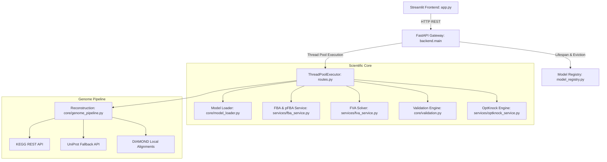

# 🧬 SynB User & Developer Flow Guide

Welcome to **SynB**, a metabolic engineering and genome reconstruction platform. This document provides a deep dive into the user journey, system architecture, and scientific methodologies powering the application.

---

## 🗺️ System Architecture & Workflow

The platform follows a decoupled **API-First Architecture**:

---

## 🚀 Step-by-Step Application Flow

### 1️⃣ Model Ingestion & Creation (The Entrypoint)
When you first open SynB, you are prompted to provide the biological blueprint. There are two entry paths:

#### Path A: Upload an Existing SBML Model (`.xml`)
*   **User Action:** Drag and drop or browse for an SBML-compliant XML file (e.g., standard models like *E. coli* `iJO1366.xml` or Yeast `iMM904.xml`).
*   **Under the Hood:**
    1.  The frontend reads the file bytes and posts to `/api/v1/upload-model`.
    2.  The backend verifies the file size does not exceed the limit (e.g., **50 MB**).
    3.  The model is parsed using `cobra.io.read_sbml_model` in a sandboxed thread worker.
    4.  The model is initialized with the selected solver (e.g., GLPK, CPLEX, Gurobi, or HiGHS) and tolerances.
    5.  It is registered in the in-memory **Model Registry** with a unique UUID.

#### Path B: Genome-to-Model Reconstruction (`.fasta`, `.fna`, `.faa`)
*   **User Action:** Upload a raw genomic or proteomic sequence.
*   **Under the Hood:**
    1.  The file is uploaded and initiates a background reconstruction job.
    2.  **Gene Annotation:** It identifies metabolic genes using **Local Reference Maps**, **DIAMOND alignment** against a curated enzyme database, and fallback queries to the **KEGG REST API** & **UniProt**.
    3.  **Reaction Mapping:** EC numbers and KEGG orthologies are mapped to stoichiometric equations.
    4.  **Model Assembly:** A metabolic network is built containing reactions, metabolites, and GPR (Gene-Protein-Reaction) rules.
    5.  **Gap-Filling:** The engine runs optimization algorithms to identify missing metabolic links ("gaps") and fills them to ensure the model has a functioning biomass production pathway.
    6.  An SBML file is generated, saved, and loaded into the active session.

---

### 2️⃣ Tab 1: 📊 Model Summary (Inspection)
Once a model is loaded, the dashboard unlocks the main analysis tabs.

*   **KPI Metrics:** Displays total reactions, metabolites, genes, and compartments. Demarcates boundary reactions: **Exchange reactions** (inputs/outputs), **Demand reactions**, and **Sink reactions**.
*   **Objective Details:** Displays what the cell is currently optimized to maximize/minimize (typically growth/biomass).
*   **Paginated Reaction Browser:** Loads lists of reactions on demand via `/reactions/{model_id}` with parameters for pagination, subsystem filters, and search terms. Avoids freezing the browser for models containing thousands of reactions.

---

### 3️⃣ Tab 2: 📈 FBA Diagnostics (Simulation)
*   **User Action:** Click **▶ Run FBA** or **⚡ Run pFBA** in the sidebar.
*   **Under the Hood:**
    *   **FBA (Flux Balance Analysis):** Computes a steady-state flux distribution that maximizes the objective function (e.g., growth rate) using linear programming:
        $$\max c^T v \quad \text{s.t.} \quad S v = 0, \quad lb \le v \le ub$$
    *   **pFBA (Parsimonious FBA):** First solves the FBA problem to find the optimal growth rate ($z^*$). Then, it runs a secondary optimization that minimizes the sum of all absolute fluxes (L1-norm) while keeping growth rate at $z^*$. This represents a more biologically realistic state where the cell minimizes enzyme production costs.
*   **Outputs:** Returns the growth rate, solver status (e.g., `optimal`), and a list of the reactions carrying the highest metabolic flux, which is rendered dynamically using interactive tables and charts.

---

### 4️⃣ Tab 3: 🔍 Validation (Quality Control)
*   **User Action:** Click **🔍 Run Validation** in the sidebar.
*   **Under the Hood:** Runs a 5-point quality audit:
    1.  **Objective Feasibility:** Verifies that the model can achieve a non-zero objective value under default conditions.
    2.  **Inconsistent Bounds:** Checks for structural errors where lower bounds exceed upper bounds ($lb > ub$).
    3.  **Gene-Orphan Reactions:** Scans for internal reactions that lack Gene-Protein-Reaction (GPR) rules.
    4.  **Blocked Reactions:** Detects reactions that can never carry flux ($v = 0$) under any steady-state conditions (via FVA).
    5.  **Mass Balance:** Validates elemental mass balance for every reaction with chemical formula annotations to ensure matter is conserved.

---

### 5️⃣ Tab 4: 📊 Flux Variability (FVA)
*   **User Action:** Adjust the "Fraction of Optimum" slider and click **📊 Run FVA** in the sidebar.
*   **Under the Hood:**
    *   FBA only gives a single optimal snapshot. FVA determines the maximum and minimum possible flux values for *each* reaction while forcing the objective value to be at least a fraction of the optimum (e.g., 90% or 100% of maximum growth):
        $$\min / \max v_i \quad \text{s.t.} \quad S v = 0, \quad lb \le v \le ub, \quad c^T v \ge \alpha \cdot z^*$$
    *   Requires $2N$ optimization solves (where $N$ is the number of reactions).
*   **Outputs:** Visualizes the flux ranges (minimum vs. maximum) using a Plotly scatter plot, highlighting which reactions are rigid (fixed rate) and which are flexible.

---

### 6️⃣ Tab 5: 🌐 Environment → Outcome (Media & Pareto Scanning)
A unified, phase-based pipeline for testing food sources and analyzing yield trade-offs:

*   **Phase 1 — Define Environment:** Configure exchange reaction bounds (uptake limits). You can use presets (e.g., **Aerobic Glucose**, **Anaerobic Glucose**, or **Minimal Closed**) or edit individual nutrient exchange bounds (e.g., oxygen, glucose, ammonia).
*   **Phase 2 — Set Objective:** Switch the optimization objective to any reaction (e.g., switch from Growth/Biomass to Ethanol production).
*   **Phase 3 — Run & Visualize:**
    *   **Quick FBA:** Run an FBA on the current medium.
    *   **Production Envelope:** Runs a sequence of LP steps scanning growth rates from $0$ to the maximum possible rate. At each point, it calculates the maximum and minimum possible product formation rates.
    *   **Output:** Plots the **Growth-Production Pareto Boundary** (Production Envelope), showing the scientific trade-offs between growth rate and chemical synthesis.

---

### 7️⃣ Tab 6: 🔬 Strain Design (OptKnock Heuristic)
*   **User Action:** Select a Target Product, a Biomass reaction, a maximum number of knockouts, and click **Run OptKnock Heuristic**.
*   **Under the Hood:**
    *   Locates optimal gene/reaction knockouts that couple the synthesis of the target chemical with cell growth.
    *   **Heuristic Engine:** Instead of a complex, computationally expensive Mixed-Integer Linear Programming (MILP) solver, it uses a **greedy sequential search**. It iteratively knocks out the reaction that yields the highest target product synthesis at the required growth fraction, evaluates the model state, and repeats.
    *   All computations occur in a temporary `with model:` context to ensure the master model in the registry is never modified.
*   **Outputs:** Returns the list of reaction knockouts suggested for genetic engineering and demonstrates the expected growth and product yields.

---

## 💻 Developer Directory Guide

When contributing to this project, refer to the following code files:

*   **Frontend UI:**
    *   [app.py](file:///Users/muhammedmidlaj/Desktop/arqgene-sybbio/app.py): Streamlit page structures, CSS styles, graphs, and API requests.
*   **Backend Server:**
    *   [backend/main.py](file:///Users/muhammedmidlaj/Desktop/arqgene-sybbio/backend/main.py): Dev server config, Lifespan Hooks, CORS Policies, and eviction loop.
    *   [backend/api/routes.py](file:///Users/muhammedmidlaj/Desktop/arqgene-sybbio/backend/api/routes.py): FastAPI endpoints, ThreadPool allocation, and error status handling.
*   **Services Layer:**
    *   [backend/services/model_registry.py](file:///Users/muhammedmidlaj/Desktop/arqgene-sybbio/backend/services/model_registry.py): In-memory storage for active cobra models with TTL eviction.
    *   [backend/services/fba_service.py](file:///Users/muhammedmidlaj/Desktop/arqgene-sybbio/backend/services/fba_service.py): Wrappers for FBA and pFBA computation.
    *   [backend/services/fva_service.py](file:///Users/muhammedmidlaj/Desktop/arqgene-sybbio/backend/services/fva_service.py): Wrappers for Flux Variability Analysis.
    *   [backend/services/optknock_service.py](file:///Users/muhammedmidlaj/Desktop/arqgene-sybbio/backend/services/optknock_service.py): Sequential LP OptKnock search algorithm.
*   **Scientific Core:**
    *   [core/genome_pipeline.py](file:///Users/muhammedmidlaj/Desktop/arqgene-sybbio/core/genome_pipeline.py): Gene annotation, reaction mapping, and model gap-filling algorithms.
    *   [core/validation.py](file:///Users/muhammedmidlaj/Desktop/arqgene-sybbio/core/validation.py): 5-point quality audit implementation.
