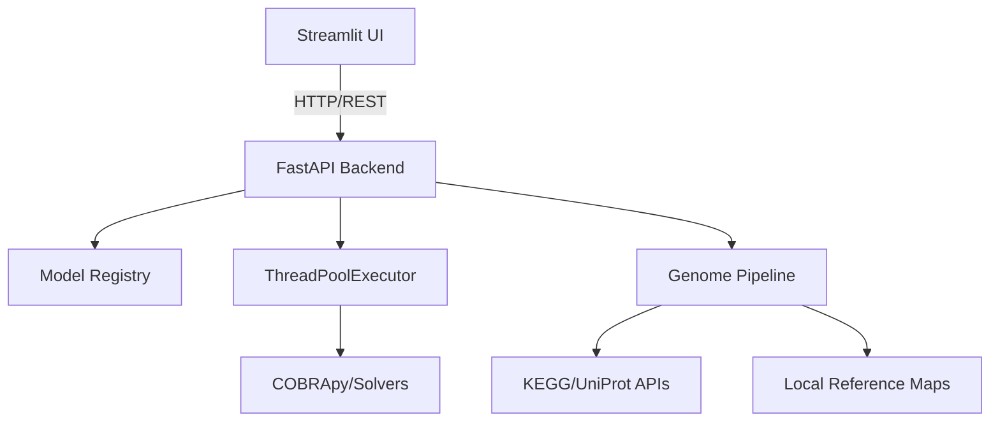

# 🧬 SynB · Metabolic Engineering & Genome Reconstruction

[](https://opensource.org/licenses/MIT)
[](https://www.python.org/downloads/)
[](https://fastapi.tiangolo.com/)
[](https://streamlit.io/)

**SynB** is a high-performance metabolic modeling platform designed for researchers. It transforms raw genomic sequences into functional, simulation-ready metabolic models using a multi-strategy annotation engine.

---

## ✨ Key Features

### 🏢 Digital Cell Factory (The "Blueprint")
Transform genomic DNA (FASTA) into a functional SBML model. The engine builds the cell's "machines" (reactions), "raw materials" (metabolites), and "manuals" (genes) from scratch.

*   **Multi-Strategy Annotation**: Combines Local Keyword Maps, KEGG REST API, and UniProt fallbacks for high-coverage annotation.
*   **Automatic Gap-Filling**: Ensures that the reconstructed model is "alive" and capable of simulating growth by bridging missing metabolic pathways.

### 📈 Advanced Simulation & Optimization
Run state-of-the-art constraint-based stoichiometric modeling:
*   **FBA/pFBA**: Calculate optimal growth rates and minimize overall metabolic flux.
*   **Validation Suite**: 5-point safety check (feasibility, bounds, orphans, blocked reactions, mass balance).
*   **Flux Variability (FVA)**: Identify metabolic flexibility and strictly necessary reactions.
*   **Production Pareto**: Scan the trade-off between growth and product formation.

### 🔬 Strain Design (OptKnock)
The "Genetic Engineering Suggester" uses a greedy LP heuristic to find the combination of gene knockouts that forces the cell to overproduce your target chemical (e.g., Ethanol, L-Lysine) as a byproduct of growth.

---

## 🚀 Getting Started

### 1️⃣ Clone and Setup
Ensure you have Python 3.9+ installed and a virtual environment active.

```bash
# Clone the repository
git clone https://github.com/[username]/synb.git
cd synb

# Initialize virtual environment
python -m venv venv
source venv/bin/activate  # macOS/Linux

# Install dependencies
pip install -r requirements.txt
```

### 2️⃣ Run the Backend (FastAPI)
The backend handles all heavy computation and model registry.

```bash
# In Terminal A
uvicorn backend.main:app --port 8000 --reload
```
*API docs at `http://localhost:8000/docs`*

### 3️⃣ Run the Frontend (Streamlit)
The frontend provides the interactive dashboard for simulation and design.

```bash
# In Terminal B
streamlit run app.py
```
*Dashboard at `http://localhost:8501`*

---

## 🏗️ Architecture



---

## 🧰 Tech Stack
*   **Backend**: FastAPI, Pydantic
*   **Frontend**: Streamlit, Plotly, Pandas
*   **Scientific Core**: COBRApy, Optlang (GLPK/GUROBI/CPLEX)
*   **Bioinformatics**: DIAMOND (optional), Biopython

---

## 📜 License
This project is licensed under the MIT License - see the [LICENSE](LICENSE) file for details.

*Created with ❤️ for the Synthetic Biology community.*
