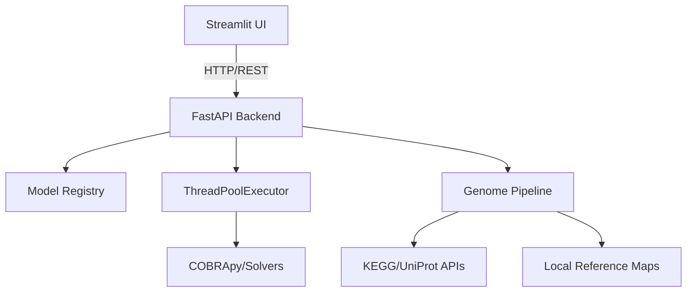

# 🧬 SynB · Metabolic Engineering & Genome Reconstruction

[](https://opensource.org/licenses/MIT)
[](https://www.python.org/downloads/)
[](https://fastapi.tiangolo.com/)
[](https://streamlit.io/)

**SynB** is a high-performance metabolic modeling platform designed for researchers. It transforms raw genomic sequences into functional, simulation-ready metabolic models using a multi-strategy annotation engine.

---

## ✨ Key Features

### 🏢 Digital Cell Factory (The "Blueprint")
Transform genomic DNA (FASTA) into a functional SBML model. The engine builds the cell's "machines" (reactions), "raw materials" (metabolites), and "manuals" (genes) from scratch.

*   **Multi-Strategy Annotation**: Combines Local Keyword Maps, KEGG REST API, and UniProt fallbacks for high-coverage annotation.
*   **Automatic Gap-Filling**: Ensures that the reconstructed model is "alive" and capable of simulating growth by bridging missing metabolic pathways.

### 📈 Advanced Simulation & Optimization
Run state-of-the-art constraint-based stoichiometric modeling:
*   **FBA/pFBA**: Calculate optimal growth rates and minimize overall metabolic flux.
*   **Validation Suite**: 5-point safety check (feasibility, bounds, orphans, blocked reactions, mass balance).
*   **Flux Variability (FVA)**: Identify metabolic flexibility and strictly necessary reactions.
*   **Production Pareto**: Scan the trade-off between growth and product formation.

### 🔬 Strain Design (OptKnock)
The "Genetic Engineering Suggester" uses a greedy LP heuristic to find the combination of gene knockouts that forces the cell to overproduce your target chemical (e.g., Ethanol, L-Lysine) as a byproduct of growth.

---

## 🚀 Getting Started

### 🔌 Prerequisites
Before starting, ensure you have:
*   **Python 3.9+** installed.
*   *(Optional)* **DIAMOND** sequence alignment tool (`brew install diamond` or download binary) for local DIAMOND-based genome annotation.

---

### ⚡ Option A: All-in-One Automated Startup (Recommended)

We have provided a comprehensive bash script that automates the virtual environment creation, dependency installation, and launches both services concurrently. It also handles graceful cleanup of all processes on exit.

```bash
# 1. Run the script from the root directory
./run_project.sh

# 2. Open your browser to the Streamlit Dashboard:
# http://localhost:8501
```

---

### 🛠️ Option B: Manual Setup (Separate Terminals)

If you prefer to manage the virtual environment and logs manually:

#### 1️⃣ Environment Setup
Create a virtual environment and install all python dependencies:

```bash
# Create a virtual environment
python3 -m venv .venv

# Activate the virtual environment
source .venv/bin/activate  # macOS/Linux
# or: .venv\Scripts\activate on Windows

# Install the required packages
pip install --upgrade pip
pip install -r requirements.txt
```

#### 2️⃣ Run the Backend (FastAPI)
The backend manages model computation, parsing, and execution. Note that the Streamlit frontend expects the backend to run on port **8001**.

```bash
# In Terminal A (with virtual env activated)
uvicorn backend.main:app --port 8001 --reload
```
*   **API Docs (Swagger UI):** [http://localhost:8001/docs](http://localhost:8001/docs)
*   **Health Check:** [http://localhost:8001/api/v1/health](http://localhost:8001/api/v1/health)

#### 3️⃣ Run the Frontend (Streamlit)
The Streamlit frontend provides the user interface for loading models, configuring the media, running FBA simulations, and analyzing outcomes.

```bash
# In Terminal B (with virtual env activated)
streamlit run app.py
```
*   **Streamlit UI:** [http://localhost:8501](http://localhost:8501)

---

## 🏗️ Architecture


```mermaid
graph TD
    A[Streamlit UI] -->|HTTP/REST| B[FastAPI Backend]
    B --> C[Model Registry]
    B --> D[ThreadPoolExecutor]
    D --> E[COBRApy/Solvers]
    B --> F[Genome Pipeline]
    F --> G[KEGG/UniProt APIs]
    F --> H[Local Reference Maps]
```

---

## 🧰 Tech Stack
*   **Backend**: FastAPI, Pydantic
*   **Frontend**: Streamlit, Plotly, Pandas
*   **Scientific Core**: COBRApy, Optlang (GLPK/GUROBI/CPLEX)
*   **Bioinformatics**: DIAMOND (optional), Biopython

---

## 📜 License
This project is licensed under the MIT License - see the [LICENSE](LICENSE) file for details.

*Created with ❤️ for the Synthetic Biology community.*
# arqgene-sybbio
